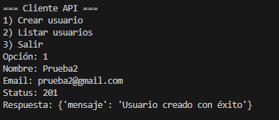
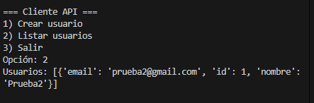
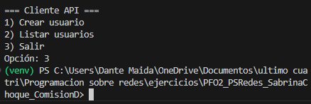

PFO2_PSRedes_SabrinaChoque_ComisionD

Alumno: Sabrina Choque  
Comisión: D  

gitHub:   

El objetivo de este proyecto es implementar una **API REST** con Python y Flask, que se conecta a una base de datos **SQLite**.  
Además, desarrollamos un **cliente en consola** que permite interactuar con la API para crear y listar usuarios.

Con este trabajo entendimos cómo:
- Establecer endpoints REST básicos.
- Guardar y recuperar datos persistentes en una base de datos.
- Conectar un cliente a la API y probar su funcionamiento.

Archivos utilizados en Python

- **app.py** → servidor Flask que expone la API REST.  
- **cliente_api.py** → cliente en consola para interactuar con la API.  
- **pfo2.db** → base de datos SQLite generada automáticamente al correr el servidor.  

Pasos de ejecución

1. Crear y activar entorno virtual (venv)
En la carpeta del proyecto, abrir una terminal y ejecutar:

Windows (PowerShell):
python -m venv venv
venv\Scripts\activate

2. Instalar dependencias
pip install flask flask_sqlalchemy requests

3. Iniciar el servidor (API)
python app.py
El servidor corre en: http://127.0.0.1:5000/

4. Probar con el cliente en otra terminal
Abrir otra terminal (con el venv activado) y ejecutar:
python cliente_api.py
En el cliente podés crear un usuario y listar usuarios.

5. Ver usuarios desde el navegador
http://127.0.0.1:5000/usuarios

6. Base de datos SQLite

La base de datos se genera automáticamente con el nombre **pfo2.db**.  
En ella se almacenan los usuarios creados desde el cliente o el navegador.

Podemos comprobar su existencia ejecutando en la terminal:
dir *.db

7. Registro, Login y ruta protegida (/tareas)
Esta sección muestra cómo crear un usuario, loguearse y acceder a la ruta protegida con Basic Auth.

Endpoints:

POST /registro → crea usuario (guarda contraseña hasheada, no en texto plano).

POST /login → verifica credenciales.

GET /tareas → requiere Basic Auth (usuario/contraseña).

Recordar dejar corriendo el servidor con python app.py.

**Registrar usuario**:
PowerShell:

Invoke-RestMethod -Method Post -Uri http://127.0.0.1:5000/registro `
  -ContentType 'application/json' `
  -Body '{ "usuario":"sabrina", "password":"1234", "nombre":"Sabrina", "email":"sabrina@example.com" }'
  

  Si /registro devuelve {"error":"usuario ya existe"} con estado 409, es correcto: ese usuario ya está creado.
  /usuarios (GET) lista id, nombre, email — no muestra contraseñas por seguridad.
  **Login**:
  PowerShell:

  Invoke-RestMethod -Method Post -Uri http://127.0.0.1:5000/login `
  -ContentType 'application/json' `
  -Body '{ "usuario":"sabrina", "password":"1234" }'
  

$pair = "sabrina:1234"
$token = [Convert]::ToBase64String([Text.Encoding]::ASCII.GetBytes($pair))
Invoke-RestMethod -Method Get -Uri http://127.0.0.1:5000/tareas -Headers @{ Authorization = "Basic $token" }

opcion web:

si se loguea correctamente lansa la pagina web tareas

Si /tareas devuelve 401 Unauthorized, verificá usuario/clave o probá en ventana incógnito (el navegador puede recordar credenciales viejas).